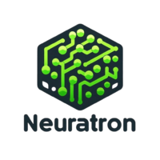
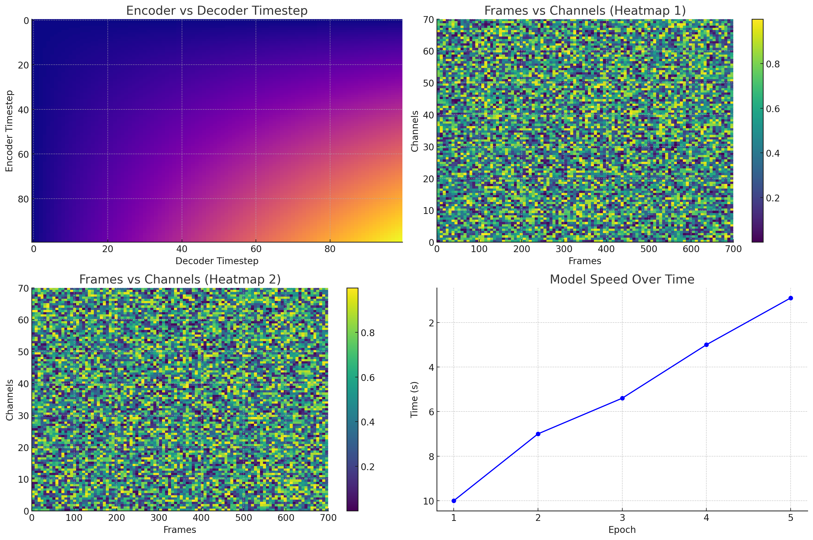

# Neuratron-lite

Natural TTS Synthesis in Real Time

This implementation includes **distributed** and **automatic mixed precision** support and uses the [RVC dataset](https://github.com/RVC-Project/Retrieval-based-Voice-Conversion-WebUI/blob/main/docs/en/README.en.md?ysclid=lzkpzrqvds251797886). Distributed and Automatic Mixed Precision support relies on NVIDIA's CUDA.

## Table of Contents
1. [Pre-requisites](#pre-requisites)
2. [Setup](#setup)
3. [Training](#training)
4. [Speed Tests](#speed-tests)
5. [Acknowledgements](#acknowledgements)
6. [License](#license)

## Pre-requisites
1. NVIDIA GPU with CUDA support.
2. [CUDA Toolkit](https://developer.nvidia.com/cuda-downloads) and [cuDNN](https://developer.nvidia.com/cudnn) installed.
3. Python 3.8 or higher.
4. [PyTorch](https://pytorch.org/) (with CUDA support).

## Soon...
